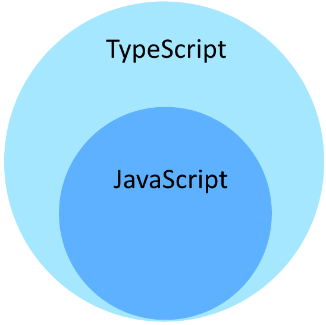
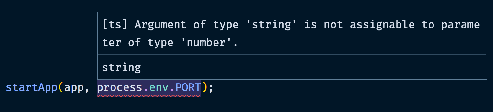
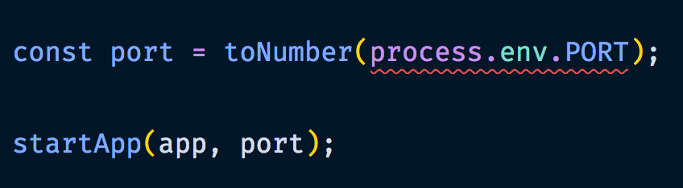
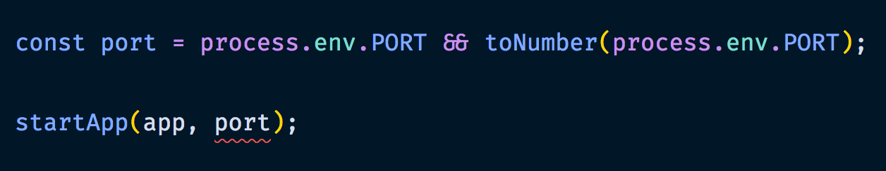
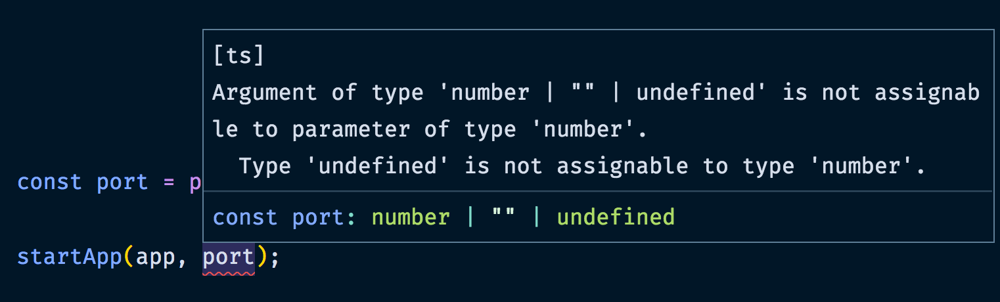
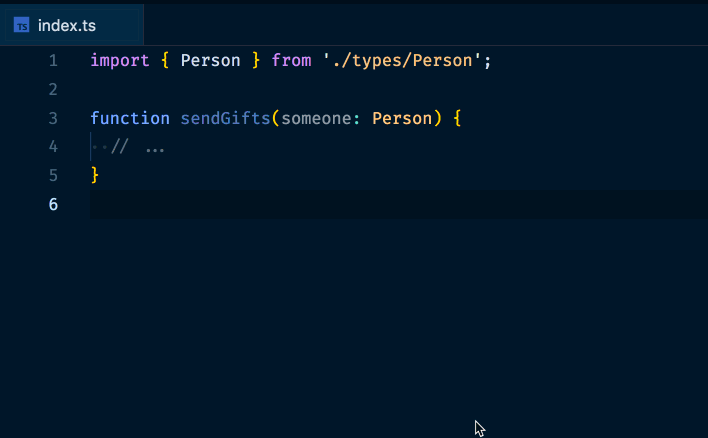
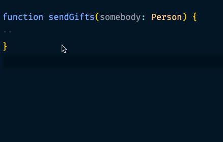
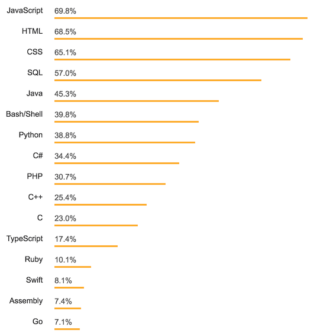

import { Head, Appear, Image } from 'mdx-deck';
import { Split } from 'mdx-deck/layouts';

import { SmallText } from './components/SmallText.js';
import { Text } from './components/Text.js';

export { theme } from './theme';

<Head>
  <title>TypeScript</title>
</Head>


# _Why?!_

---

# 🔮

# 45 minutes from now

<Appear>
  
</Appear>

---

# 🔮

# 45 minutes from now

<Appear>
  <div>
    <Text>1. You know why TS exists</Text>
  </div>
  <div>
    <Text>2. You know why developers use (and love) TS</Text>
  </div>
  <div>
    <Text>3. 🤞 You really really wanna give TS a go! 🤞</Text>
  </div>
</Appear>

```notes
- Different skills
- NOT a focus on "HOW" to write TS (another time)
```

---

# How do you prevent bugs in your code?

```notes
NOT a rhetorical question. Get some answers!
```

---

# Documentation!

<Appear>
  <div>
    <Text>• Name everything correctly</Text>
  </div>
  <div>
    <Text>• Sprinkle around some JSDoc when needed</Text>
  </div>
</Appear>

---

```js
function getUsersInSuburb(suburb) {
  return getPeople().filter(u => u.suburb === suburb);
}
```

```notes
- User = People?
- Refactor? Bad merge?
```

---

```js
/**
 * @param somebody - A person from the database
 */
function sendGifts(somebody) {}
```

```notes
- JSDoc!
- Can I pass in `getUsers` into this?
- Read implementaion
- Not 100% sure
```

---

```js
/**
 * @property {Object} person
 * @property {string} person.name
 * @property {number} person.age
 */
function logUser(user) {
  console.log(`${user.firstName} ${user.lastName} - ${user.age}`);
}
```

---

```js
/**
 * @property {object} course
 */
function sendCourseToPacMan(course) {
  // ...
}
```

```notes
Good luck documenting this!
```

---

# Documentation 😞

<Appear>
  <div>
    <Text>❌ Easily out of date</Text>
  </div>
  <div>
    <Text>❌ Difficult to refactor</Text>
  </div>
  <div>
    <Text>❌ Ambiguous</Text>
  </div>
  <div>
    <Text>❌ Difficult for complex objects</Text>
  </div>
  <div>
    <Text>❌ Often ignored</Text>
  </div>
  <div>
    <Text>✅ Sometimes useful</Text>
  </div>
</Appear>

---

# How do you prevent bugs in your code?

---

# Defensive coding!

---

```js
function startApp(app, port) {
  if (port === undefined) {
    throw new TypeError('Port is required');
  }
  if (!Number.isInteger(port)) {
    throw new TypeError('Port must be a number');
  }
  // ...
}
```

---

```js
if (person.firstName && person.lastName) {
  sayHello(person);
}
```

---

```js
function sendGifts(somebody) {
  const countryCode =
    somebody &&
    somebody.address &&
    somebody.address.country &&
    somebody.address.shortCode;

  if (!countryCode) {
    return;
  }
}
```

---

# Defensive coding 😞

<Appear>
  <div>
    <Text>❌ A lot of code to write, read, and maintain</Text>
  </div>
  <div>
    <Text>❌ Easy to miss something</Text>
  </div>
  <div>
    <Text>❌ Code anxiety</Text>
  </div>
  <div>
    <Text>✅ Interacting with unpredictable sources</Text>
  </div>
</Appear>

```notes
1. "What's this code for?" - "Oh, just to be safe" 🙄

- Anxiety = Will I receive the right inputs? Do I trust this function before passing in the inputs?

- Tick = user input, external APIs, etc
```

---

# How do you prevent bugs in your code?

---

# Unit tests!

---

```js
test('it should throw an error when person is undefined', () => {
  expect(() => sendGifts()).toThrow();
});
test('it should throw an error when person is null', () => {
  expect(() => sendGifts(null)).toThrow();
});
test('it should throw an error when person is empty', () => {
  expect(() => sendGifts({})).toThrow();
});
test('it should throw an error when missing address', () => {
  expect(() => sendGifts(userWithNoAddress)).toThrow();
});
test('it should throw an error when missing country code', () => {
  expect(() => sendGifts(userWithNoCountryCode)).toThrow();
});
```

```notes
Testing *one* parameter for *one* function
```

---

# Unit tests 😞

<Appear>
  <div>
    <Text>❌ Lots of code to write, read, and maintain</Text>
  </div>
  <div>
    <Text>❌ Verbose</Text>
  </div>
  <div>
    <Text>❌ Easy to forget to test something</Text>
  </div>
  <div>
    <Text>✅ Great for business logic</Text>
  </div>
</Appear>

```notes
1. Every function, every param, every respones
```

---

# How do you prevent bugs in your code?

---

# Let errors happen naturally!

<Appear>
  <div>
    <Text>If someone calls this function incorrectly...</Text>
  </div>
  <div>
    <Text>
      Then an error will <em>probably</em> happen...
    </Text>
  </div>
  <div>
    <Text>Eventually...</Text>
  </div>
  <div>
    <Text>Somewhere...</Text>
  </div>
  <div>
    <Text>¯\_(ツ)_/¯</Text>
  </div>
</Appear>

---

```
Uncaught TypeError: Cannot read property 'name' of undefined.
```

```
Uncaught TypeError: ‘undefined’ is not a function.
```

```
Uncaught TypeError: map is not a function.
```

```
Uncaught TypeError: Cannot read property ‘length’.
```

```notes
You see this in your logs, you're in for a murder mystery
```

---

# Let errors happen naturally 😞

<Appear>
  <div>
    <Text>❌ Cryptic errors</Text>
  </div>
  <div>
    <Text>❌ Errors occur in unexpected places</Text>
  </div>
  <div>
    <Text>❌ Silent failures</Text>
  </div>
  <div>
    <Text>❌ Errors may bubble up (and crash the entire app)</Text>
  </div>
  <div>
    <Text>❌ "It worked for me!"</Text>
  </div>
</Appear>

```notes
Worked for me - limited local use. Every scenario? Every screen?
```

---

# How do you prevent bugs in your code?

---

# 😍 🙌 🦄 🌈 ✨ TypeScript ✨ 🌈 🦄 🙌 😍

---

# What is TypeScript?

---

## It's a programming language

---

<Image src="assets/images/scared.jpg" />

---



---

## All JS code works fine in TS land!

<Appear>
  <div>
    <Text>✅ Your JS code</Text>
  </div>
  <div>
    <Text>✅ Third-party JS code</Text>
  </div>
  <div>
    <Text>✅ Yes really - JS works fine in TS!</Text>
  </div>
</Appear>

---

## TS compiles to JS

<Appear>
  <div style={{ margin: '50px' }}>
    <span
      style={{ border: '2px solid white', padding: '10px', margin: '10px' }}
    >
      .sass
    </span>
    <span style={{ margin: '10px' }}>👉</span>
    <span
      style={{ border: '2px solid yellow', padding: '10px', margin: '10px' }}
    >
      SASS Compiler
    </span>
    <span style={{ margin: '10px' }}>👉</span>
    <span
      style={{ border: '2px solid white', padding: '10px', margin: '10px' }}
    >
      .css
    </span>
  </div>
  <div style={{ margin: '50px' }}>
    <span
      style={{ border: '2px solid white', padding: '10px', margin: '10px' }}
    >
      Modern JS
    </span>
    <span style={{ margin: '10px' }}>👉</span>
    <span
      style={{ border: '2px solid yellow', padding: '10px', margin: '10px' }}
    >
      Babel compiler
    </span>
    <span style={{ margin: '10px' }}>👉</span>
    <span
      style={{ border: '2px solid white', padding: '10px', margin: '10px' }}
    >
      Compatible JS
    </span>
  </div>
  <div style={{ margin: '50px' }}>
    <span
      style={{ border: '2px solid white', padding: '10px', margin: '10px' }}
    >
      .ts
    </span>
    <span style={{ margin: '10px' }}>👉</span>
    <span
      style={{ border: '2px solid yellow', padding: '10px', margin: '10px' }}
    >
      TypeScript Compiler (tsc)
    </span>
    <span style={{ margin: '10px' }}>👉</span>
    <span
      style={{ border: '2px solid white', padding: '10px', margin: '10px' }}
    >
      .js
    </span>
  </div>
</Appear>

---

<Appear>
  <h2>⌨️ You: Write TS</h2>
  <h2>🍽 TSC: Eats TS files</h2>
  <h2>💩 TSC: Poops out JS files</h2>
  <h2>🌎 Everything: Consumes JS (as usual)</h2>
  <div>(browser, node, lambda, third-party, etc)</div>
</Appear>

---

# What is TypeScript

## Quick recap

<Appear>
  <div>
    <Text>✅ Adds new features to JS</Text>
  </div>
  <div>
    <Text>✅ Works with JS code</Text>
  </div>
  <div>
    <Text>✅ Compiles back to JS code</Text>
  </div>
  <div>
    <Text>✅ Nobody knows you wrote TS</Text>
  </div>
</Appear>

```notes
It's not a big scary new thing
```

---

<div
  style={{
    display: 'flex',
    alignItems: 'center',
    justifyContent: 'space-between',
  }}
>
  <div style={{ width: '50%' }}>
    
  </div>
  <div style={{ margin: '50px' }}>
    <div style={{ fontSize: '2em' }}>+</div>
  </div>
  <div style={{ width: '50%' }}>
    
  </div>
</div>

---

# Quiz time!

---

# Spot the Javascript

#1

```js
var title = ['TypeScript', 'is', 'really', 'cool'].join(' ').toUpperCase();
```

#2

```js
define "title" = create Array("TypeScript", "is", "really", "cool")
  then, implode with ' '
  then, stringToUpper
```

---

```js
var title = ['TypeScript', 'is', 'really', 'cool'].join(' ').toUpperCase();
```

---

# Quiz time: for two points!

---

Which organisation decided _this_ is JavaScript:

```js
var title = ['TypeScript', 'is', 'really', 'cool'].join(' ').toUpperCase();
```

But this is _not_ JavaScript:

```js
define "title" = create Array("TypeScript", "is", "really", "cool")
  then, implode with ' '
  then, stringToUpper
```

---


---

# Who?!

<Appear>
  <div>
    <Text>Let's check their website...</Text>
  </div>
</Appear>

---


<Appear>
  <div>
    <Text>Not much help...</Text>
  </div>
</Appear>

---


<Appear>
  <div>
    <Text>• An organisation</Text>
  </div>
  <div>
    <Text>• 1961</Text>
  </div>
  <div>
    <Text>• Not for profit</Text>
  </div>
  <div>(explains the website)</div>
</Appear>

---


They develop standards:

- CD-ROM file structure
- C#
- CLI
- Open Office XML
- JSON
- Dart

and...

---

# ECMAScript

<Appear>
  <div>
    <Text>• Generic language</Text>
  </div>
  <div>
    <Text>• Any language can follow ECMAScript standards</Text>
  </div>
  <div>
    <Text>Including...</Text>
  </div>
  <div>
    <Text>• ActionScript</Text>
  </div>
  <div>
    <Text>• JavaScript</Text>
  </div>
  <div>
    <Text>• TypeScript</Text>
  </div>
</Appear>

```notes
ES in ES6 = ECMAScript
```

---

# Quiz time: for three points!

<div style={{ maxWidth: '70%', margin: '0 auto' }}>
  <Appear>
    <div>
      <Text>
        Which committee, formed by ECMA International, meet fortnightly to
        discuss ECMAScript?
      </Text>
    </div>
  </Appear>
</div>

---


<Appear>
  <div>
    <Text>Once a fortnight:</Text>
  </div>
  <div>
    <Text>• Discuss proposals</Text>
  </div>
  <div>
    <Text>• Get drunk</Text>
  </div>
</Appear>

---

# 4 stages of a TC39 proposal

---

# 🤔

## Stage 1

### Proposal

TC39 devotes time to examining problem and solution

---

# ✏️

## Stage 2

### Draft

Accepted!

TC39 formalises specs and sytax

---

# ⌨️

## Stage 3

### Candidate

Ready to be implemented (in code)

---

# 🎉

## Stage 4

### Finished

Added to the next ECMAScript release

---

# TC39 proposals are on GitHub

https://github.com/tc39/proposals

---

# JS + TS

Super quick history


---

<Image src="assets/images/yawn.gif" />

---

# December 1999

## ES3 released

- Regex
- Try / catch

---

# October 2008

(~9 years later)

## ES4 abandoned

- Political differences
- Public feuds between Netscape, Mozilla, and Microsoft
- Fun fact: Macromedia implemented ES4 into ActionScript!

---

# December 2009

(~1 year later)

## ES5 released

- Strict mode
- Aligning and clarifying existing standards
- (Not much)

---

tldr

~10 years, not much happened

---

# Meanwhile

Someone was getting impatient...

---


---

# And especially...

---

# THIS GUY


## Anders Hejlsberg

- Works at Microsoft
- Lead architect of C#
- Creator of TypeScript

---


- Reaching Stage 4 takes too long
- Politics & BS
- Wants those tasty proposals NOW!

```notes
Want those proposed features _now_!
```

---

# 2010

(~1 year late after ES5)

- Anders started working on TypeScript
- Started implementing <strong>Stage 3</strong> (candidate) proposals

---

# October 2012

(~2 years later)

## 🎉 First TypeScript release 🎉

- Classes
- Arrow functions
- Default parameters
- Promises
- Modules
- Destructuring
- Template strings
- More!!

```notes
- Look familiar
- 2012
```

---

# June 2015

(~3 years later)

## 🎉 ES6 release 🎉

- All the features listed before

---

# November 2015

(~3 months later)

- TS supports async / await

---

# June 2017

(~1.5 years later)

- ES8 supports async / await

---

# Quick recap

<Appear>
  <div>
    <Text>• JS was slow and political</Text>
  </div>
  <div>
    <Text>• TS implements TC39 proposals at Stage 3 (candidate)</Text>
  </div>
  <div>
    <Text>
      • TS and JS features were <em>very different</em> until 2015 (ES6 release)
    </Text>
  </div>
  <div>
    <Text>
      • TS and JS features are <em>very similar</em> today
    </Text>
  </div>
</Appear>

```notes
- Decorators is actually Stage 2, but really wanted it for Angular 2
```

---

export default Split;


- Decorators
- Abstract classes
- Read only properties
- Private & protected properties
- Static types

---

# Static types

It's the biggest differentiator

<strong style={{ fontSize: '2em' }}>
  <u>Type</u>Script
</strong>

---

# QUIZ TIME!

---

```javascript
const name = 'Jeremy';
const age = 54;
const answer = name + age;
console.log(answer);
```

---

```javascript
const name = 'Jeremy';
const age = 54;
const answer = name + age;
console.log(answer);
```

```
"Jeremy54"
```

---

# What happened?

```javascript
// HEY, MY NAME IS JAVASCRIPT
// HERE I GO!

const name = 'Jeremy'; // AWESOME!
const age = 54; // ALRIGHT!
const answer = name + age; // HANG ON...

const answer = name + new Number(age).toString(); // THAT'S BETTER!

console.log(answer); // "Jeremy54"
```

---

# Weak types

<Appear>
  <div>
    
  </div>
  <div>
    <Text>
      • JavaScript
      <br />
      • TypeScript
      <br />
      • PHP
      <br />• C
    </Text>
  </div>
</Appear>

---

# Strong types

```javascript
const name = 'Jeremy';
const age = 54;
const answer = name + age;
console.log(answer);
```

❌ Nope! Throw an error.

---

# Strong types


<Appear>
  <div>
    <Text>
      • Python
      <br />
      • Ruby
      <br />
      • C#
      <br />• Java
    </Text>
  </div>
</Appear>

---

# QUIZ TIME AGAIN

---

```js
const name = 'Jeremy';
const answer1 = name.toLowerCase();
console.log(answer1);

const age = 52;
const answer2 = age.toLowerCase();
console.log(answer2);

const answer3 = name + age;
console.log(answer3);
```

---

```
"jeremy"
TypeError: age.toLowerCase is not a function
```

---

```js
// HEY, MY NAME IS JAVASCRIPT
// HERE I GO!

const name = 'Jeremy'; // SURE!
const answer1 = name.toLowerCase(); // "jeremy"
console.log(answer1); // ALRIGHTY!

const age = 52; // SOUNDS GOOD!
const answer2 = age.toLowerCase(); // NOPE. BYE.
console.log(answer2);

const answer3 = name + age;
console.log(answer3);
```

```notes
Macgyver can't save this code
```

---

# Dynamic types


<Appear>
  <div>
    <Text>
      • JavaScript
      <br />
      • Python
      <br />
      • Ruby
      <br />• PHP
    </Text>
  </div>
</Appear>

---

```js
const name = 'Jeremy';
const answer1 = name.toLowerCase();
console.log(answer1);

const age = 42;
const answer2 = age.toLowerCase();
console.log(answer2);

const answer3 = name + age;
console.log(answer3);
```

❌ "Woah, hey, no, stop! SOMETHING IS WRONG!"

👎 "I'm not gonna even run this code!"

---

# Static types


<Appear>
  <div>
    <Text>
      • Java
      <br />
      • C#
      <br />• C
    </Text>
  </div>
  <div>
    <Text>
      and... <strong>TypeScript!</strong>
    </Text>
  </div>
</Appear>

---

<table style={{ fontSize: '2em' }}>
  <tr>
    <td>&nbsp;</td>
    <td style={{ padding: '30px' }}>
      <strong>🐧⚽️ Dynamic</strong>
    </td>
    <td style={{ padding: '30px' }}>
      <strong>👷‍♀️🔍 Static</strong>
    </td>
  </tr>
  <tr>
    <td style={{ padding: '30px' }}>
      <strong>🛠 Weak</strong>
    </td>
    <td style={{ padding: '30px', border: '1px solid white' }}>
      • JavaScript
      <br />• PHP
    </td>
    <td style={{ padding: '30px', border: '1px solid white' }}>
      • TypeScript
      <br />• C
    </td>
  </tr>
  <tr>
    <td style={{ padding: '30px' }}>
      <strong>🚫 Strong</strong>
    </td>
    <td style={{ padding: '30px', border: '1px solid white' }}>
      • Python
      <br />• Ruby
    </td>
    <td style={{ padding: '30px', border: '1px solid white' }}>
      • C#
      <br />• Java
    </td>
  </tr>
</table>

---

# Quick recap

- TypeScript is weakly typed 🛠
- TypeScript is statically typed

<div style={{ margin: '50px' }}>
  <span style={{ border: '2px solid white', padding: '10px', margin: '10px' }}>
    .ts
  </span>
  <span style={{ margin: '10px' }}>👉</span>
  <span style={{ border: '2px solid yellow', padding: '10px', margin: '10px' }}>
    tsc
  </span>
  <span style={{ margin: '10px' }}>👉</span>
  <span style={{ border: '2px solid red', padding: '10px', margin: '10px' }}>
    👷👷‍♀️🔍 Type checking
  </span>
  <span style={{ margin: '10px' }}>👉</span>
  <span style={{ border: '2px solid white', padding: '10px', margin: '10px' }}>
    .js
  </span>
</div>

---

# What's so good about static types?

---

```js
function startApp(app) {
  // ...
}
```

---

```js
const app = new App();
```

```js
const expressApp = createExpressApp();
```

```js
startApp(/* ?!? */);
```

---

```ts
function startApp(app: ExpressApplication) {
  // ...
}
```

---

```ts
function startApp(app: ExpressApplication) {
  // ...
}
```

Task: Add new parameter named 'port'.

- Port is required
- Port must be a number

---

# The JS Way

<Appear>
  <div>
    <Text>• Defensive coding</Text>
  </div>
  <div>
    <Text>• Unit tests</Text>
  </div>
  <div>
    <Text>• Documentation</Text>
  </div>
</Appear>

---

```ts
function startApp(app: ExpressApplication, port: number) {
  // ...
}
```

---

```ts
startApp(expressApp, 80);
```

<div style={{ margin: '50px' }}>
  <span style={{ border: '2px solid white', padding: '10px', margin: '10px' }}>
    .ts
  </span>
  <span style={{ margin: '10px' }}>👉</span>
  <span style={{ border: '2px solid yellow', padding: '10px', margin: '10px' }}>
    tsc
  </span>
  <span style={{ margin: '10px' }}>👉</span>
  <span style={{ border: '2px solid red', padding: '10px', margin: '10px' }}>
    👷👷‍♀️🔍 Type checking
  </span>
  <span style={{ margin: '10px' }}>👉</span>
  <span style={{ border: '2px solid green', padding: '10px', margin: '10px' }}>
    ✅
  </span>
  <span style={{ margin: '10px' }}>👉</span>
  <span style={{ border: '2px solid white', padding: '10px', margin: '10px' }}>
    .js
  </span>
</div>

---

```ts
startApp(expressApp, '80');
```

<div style={{ margin: '50px' }}>
  <span style={{ border: '2px solid white', padding: '10px', margin: '10px' }}>
    .ts
  </span>
  <span style={{ margin: '10px' }}>👉</span>
  <span style={{ border: '2px solid yellow', padding: '10px', margin: '10px' }}>
    tsc
  </span>
  <span style={{ margin: '10px' }}>👉</span>
  <span style={{ border: '2px solid red', padding: '10px', margin: '10px' }}>
    👷👷‍♀️🔍 Type checking
  </span>
  <span style={{ margin: '10px' }}>👉</span>
  <span style={{ border: '2px solid red', padding: '10px', margin: '10px' }}>
    ❌ Error - startApp() - 'port' must be a number
  </span>
</div>

---

Task: Allow port to be set by environment variables

---

```ts
startApp(app, process.env.PORT);
```

---


---



---

```ts
// util.ts

export function toNumber(x: string): number {
  return parseInt(x, 10);
}
```

---

```ts
// util.ts

export const toNumber = (x: string): number => parseInt(x, 10);
```

---

```ts
const port: number = toNumber(process.env.PORT);

startApp(app, port);
```

---

```ts
const port = toNumber(process.env.PORT);

startApp(app, port);
```

---



---


---

```ts
const port = process.env.PORT && toNumber(process.env.PORT);

startApp(app, port);
```

---



---



---

```ts
const port = process.env.PORT ? toNumber(process.env.PORT) : 80;

startApp(app, port);
```

---

# 🤖 🔍 ✅

## A helpful robot sidekick

Helping you write better code

```notes
Linting on steroids
```

---

```ts
function sendGifts(somebody: Person) {
  // ...
}
```

```ts
interface Person {
  firstName: string;
  lastName: string;
  address: Address;
}
```

---

```ts
interface Address {
  street: string;
  suburb: string;
  country: Country;
}
```

---

```ts
interface Country {
  name: string;
  shortCode: string;
}
```

---

```ts
const jeremy: Person = {
  firstName: 'Jeremy',
  lastName: 'Bearimy',
  address: {
    street: '42 Batman Road',
    suburb: 'Melbourne',
    country: {
      name: 'Australia',
      shortCode: 'AU',
    },
  },
};
```

<div style={{ margin: '50px' }}>
  <span style={{ border: '2px solid white', padding: '10px', margin: '10px' }}>
    .ts
  </span>
  <span style={{ margin: '10px' }}>👉</span>
  <span style={{ border: '2px solid yellow', padding: '10px', margin: '10px' }}>
    tsc
  </span>
  <span style={{ margin: '10px' }}>👉</span>
  <span style={{ border: '2px solid red', padding: '10px', margin: '10px' }}>
    👷👷‍♀️🔍 Type checking
  </span>
  <span style={{ margin: '10px' }}>👉</span>
  <span style={{ border: '2px solid green', padding: '10px', margin: '10px' }}>
    ✅
  </span>
  <span style={{ margin: '10px' }}>👉</span>
  <span style={{ border: '2px solid white', padding: '10px', margin: '10px' }}>
    .js
  </span>
</div>

---

```ts
const incompleteJeremy: Person = {
  firstName: 'Jeremy',
  address: {
    suburb: 'Melbourne',
  },
};
```

<div style={{ margin: '50px' }}>
  <span style={{ border: '2px solid white', padding: '10px', margin: '10px' }}>
    .ts
  </span>
  <span style={{ margin: '10px' }}>👉</span>
  <span style={{ border: '2px solid yellow', padding: '10px', margin: '10px' }}>
    tsc
  </span>
  <span style={{ margin: '10px' }}>👉</span>
  <span style={{ border: '2px solid red', padding: '10px', margin: '10px' }}>
    👷👷‍♀️🔍 Type checking
  </span>
  <span style={{ margin: '10px' }}>👉</span>
  <span style={{ border: '2px solid red', padding: '10px', margin: '10px' }}>
    ❌ 'incompleteJeremy' is missing properties X, Y, Z
  </span>
</div>

---



---

```js
function sendGifts(somebody) {
  const countryCode =
    somebody &&
    somebody.address &&
    somebody.address.country &&
    somebody.address.shortCode;

  if (!countryCode) {
    return;
  }
}
```

---

```ts
function sendGifts(somebody: Person) {
  const countryCode = somebody.address.country.shortCode;
}
```

```notes
Trust the compiler. Guarantee.
```

---



```notes
- Works for complex objects
- Manipulating arrays
```

---

Task: Allow people to have multiple addresses

---

```ts
interface Person {
  firstName: string;
  lastName: string;
  address: [Address];
}
```

---


```notes
Can you guarantee you didn't break anything?

TYPESCRIPT CAN!
```

---

# Refactoring

<Appear>
  <div>
    <Text>✅ Rename exports</Text>
  </div>
  <div>
    <Text>✅ Rename properties</Text>
  </div>
  <div>
    <Text>✅ Rename files</Text>
  </div>
</Appear>

```notes
- TS knows how your app fits together 100%
- VS Code has some plugins that tries to guess
```

---

# Third-party libs

<Appear>
  <div>
    <Text>✅ Written in TS? Boom.</Text>
  </div>
  <div>
    <Text>✅ Written in JS? ~5500 libraries manually typed.</Text>
  </div>
  <div>
    <Text>✅ Reduce documentation lookup</Text>
  </div>
  <div>
    <Text>✅ Confidence on inputs and outputs</Text>
  </div>
</Appear>

---

# On the rise

2018 Stack Overflow Survey results



```notes
- JS = #1
- TS = #12
- Beats out Ruby, Swift, and Go
- Angular 2+
```

---

# Downsides

<Appear>
  <div>
    <Text>• May scare newbies</Text>
  </div>
  <div>
    <Text>• Verbose</Text>
  </div>
  <div>
    <Text>• Requires compile step</Text>
  </div>
  <div>
    <Text>• Complicates toolchain<br />(bundlers, test runners, linters, etc)</Text>
  </div>
  <div>
    <Text>• Bugs still possible</Text>
  </div>
  <div>
    <Text>• May be overkill for small projects</Text>
  </div>
</Appear>

---

# ☝️ I'll try it!

- http://www.typescriptlang.org/play/
- https://www.typescriptlang.org/docs/handbook/typescript-in-5-minutes.html

```
npm install typescript -g
cd /your-new-ts-app/
tsc index.ts
node index.js
```

```
npm install ts-node -g
ts-node index.ts
```

---

# 💪 TypeScript 👍

<Appear>
  <div>✅ Helpful robot sidekick</div>
  <div>✅ Less errors</div>
  <div>✅ Autocomplete</div>
  <div>✅ Up-to-date docs</div>
  <div>✅ Less defensive coding</div>
  <div>✅ Less code to write, read, and maintain</div>
  <div>✅ Less unit tests</div>
  <div>✅ Improve error messages and debugging</div>
  <div>✅ Helps refactor</div>
  <div>✅ Third-party library support</div>
  <div>✅ Big community</div>
  <div>✅ Growing</div>
</Appear>

---

# You made it!

<Appear>
  <div>
    <Text>1. You know why TS exists</Text>
  </div>
  <div>
    <Text>2. You know why developers use (and love) TS</Text>
  </div>
  <div>
    <Text>3. 🤞 You really really wanna give TS a go! 🤞</Text>
  </div>
</Appear>
