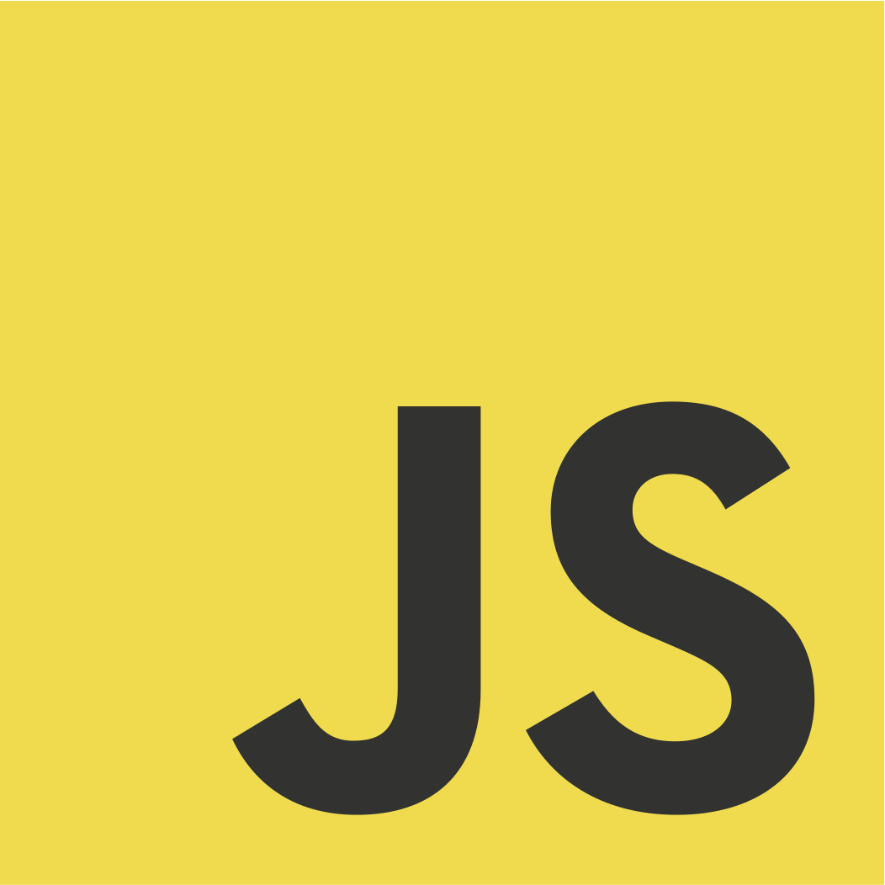
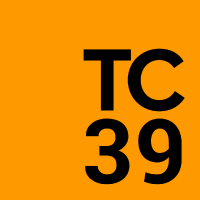

import { Head, Appear, Image } from "mdx-deck"
import { Split } from "mdx-deck/layouts"

import { SmallText } from "./components/SmallText.js"
import { Text } from "./components/Text.js"

export { theme } from "./theme"

<Head>
  <title>TypeScript</title>
</Head>


_What?!_

<SmallText>and</SmallText>

_Why?!_

---

# 🔮

# 30 minutes from now

<Appear>
  
</Appear>

---

# 🔮

# 30 minutes from now

<Appear>
  <div>
    <Text>
      1. You know <em>what</em> TS is
    </Text>
  </div>
  <div>
    <Text>
      2. You know <em>why</em> people use TS
    </Text>
  </div>
  <div>
    <Text>3. You really really wanna give TS a go! 🤞</Text>
  </div>
</Appear>

```notes
- Different skills
- NOT a focus on "HOW" to write TS (another time)
```

---

# What is TS?

---

## It's a programming language

---

<Image src="assets/images/scared.jpg" />

---


---

## All JS code works fine in TS land!

<Appear>
  <div>
    <Text>✅ Your JS code</Text>
  </div>
  <div>
    <Text>✅ Third party JS code</Text>
  </div>
  <div>
    <Text>✅ Yes really - JS works fine in TS!</Text>
  </div>
</Appear>

---

## TS compiles to JS

<Appear>
  <div style={{ margin: "50px" }}>
    <span
      style={{ border: "2px solid white", padding: "10px", margin: "10px" }}
    >
      .sass
    </span>
    <span style={{ margin: "10px" }}>👉</span>
    <span
      style={{ border: "2px solid yellow", padding: "10px", margin: "10px" }}
    >
      SASS Compiler
    </span>
    <span style={{ margin: "10px" }}>👉</span>
    <span
      style={{ border: "2px solid white", padding: "10px", margin: "10px" }}
    >
      .css
    </span>
  </div>
  <div style={{ margin: "50px" }}>
    <span
      style={{ border: "2px solid white", padding: "10px", margin: "10px" }}
    >
      Modern JS
    </span>
    <span style={{ margin: "10px" }}>👉</span>
    <span
      style={{ border: "2px solid yellow", padding: "10px", margin: "10px" }}
    >
      Babel compiler
    </span>
    <span style={{ margin: "10px" }}>👉</span>
    <span
      style={{ border: "2px solid white", padding: "10px", margin: "10px" }}
    >
      Compatible JS
    </span>
  </div>
  <div style={{ margin: "50px" }}>
    <span
      style={{ border: "2px solid white", padding: "10px", margin: "10px" }}
    >
      .ts
    </span>
    <span style={{ margin: "10px" }}>👉</span>
    <span
      style={{ border: "2px solid yellow", padding: "10px", margin: "10px" }}
    >
      TypeScript Compiler (tsc)
    </span>
    <span style={{ margin: "10px" }}>👉</span>
    <span
      style={{ border: "2px solid white", padding: "10px", margin: "10px" }}
    >
      .js
    </span>
  </div>
</Appear>

---

<Appear>
  <h2>⌨️ You: Write TS</h2>
  <h2>🍽 TSC: Eats TS files</h2>
  <h2>💩 TSC: Poops out JS files</h2>
  <h2>🌎 Everything: Consumes JS (as usual)</h2>
  <div>(browser, node, lambda, third party)</div>
  <h1>Nobody knows you wrote TS</h1>
</Appear>

---

# TypeScript

## Quick recap

<Appear>
  <div>
    <Text>✅ Adds new features to JS</Text>
  </div>
  <div>
    <Text>✅ Works with JS code</Text>
  </div>
  <div>
    <Text>✅ Compiles back to JS code</Text>
  </div>
</Appear>

---

# TS is not a big scary new thing

---

<div
  style={{
    display: "flex",
    alignItems: "center",
    justifyContent: "space-between",
  }}
>
  <div style={{ width: "50%" }}>
    
  </div>
  <div style={{ margin: "50px" }}>
    <div style={{ fontSize: "2em" }}>+</div>
  </div>
  <div style={{ width: "50%" }}>
    
  </div>
</div>

---

# Quiz time!

---

# Spot the Javascript

#1

```js
var title = ["TypeScript", "is", "really", "cool"].join(" ").toUpperCase()
```

#2

```js
define "title" = create Array("TypeScript", "is", "really", "cool")
  then, implode with ' '
  then, stringToUpper
```

---

```js
var title = ["TypeScript", "is", "really", "cool"].join(" ").toUpperCase()
```

---

# Quiz time: for two points!

---

Which organisation decided _this_ is JavaScript:

```js
var title = ["TypeScript", "is", "really", "cool"].join(" ").toUpperCase()
```

But this is _not_ JavaScript:

```js
define "title" = create Array("TypeScript", "is", "really", "cool")
  then, implode with ' '
  then, stringToUpper
```

---


---

# Who?!

<Appear>
  <div>
    <Text>Let's check their website...</Text>
  </div>
</Appear>

---


<Appear>
  <div>
    <Text>Not much help...</Text>
  </div>
</Appear>

---


<Appear>
  <div>
    <Text>• An organisation</Text>
  </div>
  <div>
    <Text>• 1961</Text>
  </div>
  <div>
    <Text>• Not for profit</Text>
  </div>
  <div>(explains the website)</div>
</Appear>

---


They develop standards:

<Appear>
  <div>• CD-ROM file structure</div>
  <div>• C#</div>
  <div>• CLI</div>
  <div>• Open Office XML</div>
  <div>• JSON</div>
  <div>• Dart</div>
  <div>
    <Text>and...</Text>
  </div>
</Appear>

---

# ECMAScript

<Appear>
  <div>
    <Text>• Generic language</Text>
  </div>
  <div>
    <Text>• Any language can follow ECMAScript standards</Text>
  </div>
  <div>
    <Text>Including...</Text>
  </div>
  <div>
    <Text>• ActionScript</Text>
  </div>
  <div>
    <Text>• JavaScript</Text>
  </div>
  <div>
    <Text>• TypeScript</Text>
  </div>
</Appear>

```notes
Maybe touch on ES6 / ES2015
```

---

# Quiz time: for three points!

<div style={{ maxWidth: "70%", margin: "0 auto" }}>
  <Appear>
    <div>
      <Text>
        Which committee, formed by ECMA International, meet fortnightly to
        discuss ECMAScript?
      </Text>
    </div>
  </Appear>
</div>

---



<Appear>
  <div>
    <Text>Once a fortnight:</Text>
  </div>
  <div>
    <Text>• Discuss proposals</Text>
  </div>
  <div>
    <Text>• Get drunk</Text>
  </div>
</Appear>

---

# 4 stages of a TC39 proposal

---

# 🤔

## Stage 1

### Proposal

TC39 devotes time to examining problem and solution

---

# ✏️

## Stage 2

### Draft

• Work on the syntax and formal specs

• TC39 expects the feature to be developed and included in the standard

---

# ⌨️

## Stage 3

### Candidate

The proposal is ready to be implemented in code

---

# 🎉

## Stage 4

### Finished

The feature is added to the next ECMAScript release

---

# TC39 proposals are on GitHub

https://github.com/tc39/proposals

---

<Image src="assets/images/yawn.gif" />

---

A proposal can take _years_ to reach Stage 4 and land in JavaScript.

Meanwhile, someone was getting impatient...

---


---

# And especially...

---

# THIS GUY


## Anders Hejlsberg

- Works at Microsoft
- Lead architect of C#
- Creator of TypeScript

---

# JS + TS

Super quick history


---

# December 1999

- ES3
- Regex
- Try / catch

---

# 2009

(10 years later)

- ES4 abandoned (political differences)
- ES5 released
- Strict mode
- Aligning and clarifying existing standards
- (Not much)

---

# Meanwhile...

- MS (especially Anders) not happy with ES / JS
- Too slow
- Too political
- They wanted to use those proposed features _now_!


---

# 2010

(1 year later)

- Anders started working on TypeScript
- Started implementing <strong>Stage 3</strong> proposals

---

# October 2012

(2 years later)

- 🎉 First TypeScript release!
- Classes
- Arrow functions
- Default parameters
- Promises
- Modules
- Destructuring
- Template strings
- More!!

---

# June 2015

(3 years later)

- 🎉 ES6 finally released!
- All the features listed before

---

# November 2015

(3 months later)

- TS supports async / await

---

# June 2017

(1.5 years later)

- ES8 supports async / await

---

# Today

TS and JS features are pretty much the same.

- Decorators
- Abstract classes
- Read only properties
- Private / protected properties

---

# QUICK RECAP

- MS / Anders created TS because ES / JS was slow and outdated
- TS implements TC39 proposals at Stage 3
- TS and JS features were very different between 2012 - 2015
- TS and JS features are very similar today since 2017

---

# There must be _more_ to TypeScript?

<Appear>
  <div>
    <Text>There is!</Text>
  </div>
  <div>
    <Text>(hint: it's in the name)</Text>
  </div>
  <div>
    <Text>
      <strong>Type</strong>Script
    </Text>
  </div>
</Appear>

---

# QUIZ TIME!

---

```javascript
const name = "Jeremy"
const age = 54
const answer = name + age
console.log(answer)
```

---

```javascript
const name = "Jeremy"
const age = 54
const answer = name + age
console.log(answer)
```

```
"Jeremy54"
```

---

# What happened?

---

# Weak types


(aka "loose" types)

<Appear>
  <div>
    <Text>
      • JS
      <br />
      • TS
      <br />
      • PHP
      <br />• C
    </Text>
  </div>
</Appear>

---

Behind the scenes footage:

```javascript
const name = "Jeremy"
const age = 54
const answer = name + new Number(age).toString()
console.log(answer)
// "Jeremy54"
```

---

# Strong types

```javascript
const answer = "Jeremy" + 54
```

Throws an error.

<Appear>
  <div>
    
  </div>
  <div>
    <Text>
      • Python
      <br />
      • Ruby
      <br />
      • C#
      <br />• Java
    </Text>
  </div>
</Appear>

---

# QUIZ TIME AGAIN

---

```js
const name = "Jeremy"
const answer1 = name.toLowerCase()
console.log(answer1)

const age = 42
const answer2 = age.toLowerCase()
console.log(answer2)

const answer3 = name + age
console.log(answer3)
```

---

```
"jeremy"
TypeError: age.toLowerCase is not a function
```

---

```js
// HEY, MY NAME IS JAVASCRIPT
// HERE I GO!

const name = "Jeremy" // SURE!
const answer1 = name.toLowerCase() // SOUNDS GOOD!
console.log(answer1) // ALRIGHTY!

const age = 42 // YEP!
const answer2 = age.toLowerCase() // NOPE. BYE.
console.log(answer2)

const answer3 = name + age
console.log(answer3)
```

---

# Dynamic types


<Appear>
  <div>
    <Text>
      • JS
      <br />
      • Python
      <br />
      • Ruby
      <br />• PHP
    </Text>
  </div>
</Appear>


---

# Static types

<Appear>
  <div>
    <Text>
      Code is checked for type errors before executing anything.
    </Text>
    <Text>
      Usually done when compiled.
    </Text>
  </div>
</Appear>

---

# Static types

```js
const name = "Jeremy"
const answer1 = name.toLowerCase()
console.log(answer1)

const age = 42
const answer2 = age.toLowerCase()
console.log(answer2)

const answer3 = name + age
console.log(answer3)
```

<Appear>
  <div>
    <Text>
      Static type language says:
    </Text>
    </div><div>
    <Text>
      ❌ "Woah, hey, no, stop! SOMETHING IS WRONG!"
    </Text>
  </div>
  <div>
    <Text>
      😵 "I'm not gonna even run this code!"
    </Text>
  </div>
</Appear>

---

# Static types


<Appear>
  <div>
    <Text>
      • Java
      <br />
      • C#
      <br />
      • C
    </Text>
  </div>
  <div>
    <Text>and... <strong>TYPESCRIPT!</strong></Text>
  </div>
</Appear>

---

<table style={{ fontSize: '2em' }}>
  <tr>
    <td>&nbsp;</td>
    <td style={{ padding: "30px" }}>
      <strong>🐧 Dynamic</strong>
    </td>
    <td style={{ padding: "30px" }}>
      <strong>👷 Static</strong>
    </td>
  </tr>
  <tr>
    <td style={{ padding: "30px" }}>
      <strong>🐣 Weak</strong>
    </td>
    <td style={{ padding: "30px" }}>
      • JavaScript
      <br />
      • PHP
    </td>
    <td style={{ padding: "30px" }}>
      • TypeScript
      <br />
      • C
    </td>
  </tr>
  <tr>
    <td style={{ padding: "30px" }}>
      <strong>💪 Strong</strong>
    </td>
    <td style={{ padding: "30px" }}>
      • Python
      <br />
      • Ruby
    </td>
    <td style={{ padding: "30px" }}>
      • C#
      <br />
      • Java
    </td>
  </tr>
</table>

---


---

